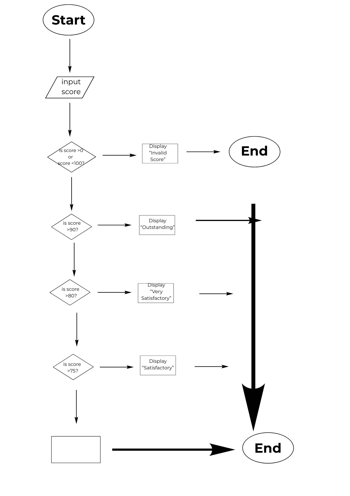

# Part 1 - Analyze the Logic

## Input
What information does the program need?

> The program needs the student's score to determine their performance classification.

## Valid Range

**Minimum valid score:**

> 0

**Maximum valid score:**

> 100

## Possible Outputs

1. Invalid Score.
2. Outstanding
3. Very Satisfactory
4. Satisfactory
5. Needs Improvement

## Boundary Condition

What condition will you use to determine whether the score is valid?

> The program will check if the score is below 0 or above 100. If either condition is true, the score is invalid.

## Multiple Decision Paths

Explain how the program decides which classification should be displayed.

> The program checks the score through several conditions. It first checks if the score is outside the valid range, then checks each classification from the highest score range to the lowest until it finds the correct result.

# Part 2

## Flowchart

Insert your flowchart below

# Part 3

## Pseudocode

START

INPUT score

IF score < 0 OR score > 100 THEN
    DISPLAY "Invalid Score."

ELSE IF score >= 90 THEN
    DISPLAY "Outstanding"

ELSE IF score >= 80 THEN
    DISPLAY "Very Satisfactory"

ELSE IF score >= 75 THEN
    DISPLAY "Satisfactory"

ELSE
    DISPLAY "Needs Improvement"

END

