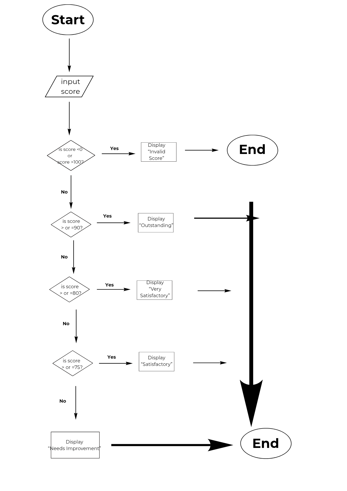

# Clean Decision Code Makeover: Student Score Checker
**Name:** Jireh Jorge S. Loquinerio
**Section:** 8-Dahlia
---
## Activity Overview

In this activity, I improved a Student Score Checker by applying proper coding standards and selection structures. 
The program accepts a student score from 0 to 100 and determines the appropriate classification. 

The classifications are: 
| Score | Classification |
|---:|---|
| 90-100 | Outstanding |
| 80-89 | Very Satisfactory |
| 75-79 | Satisfactory |
| 0 - 74 | Needs Improvement |

Scores below 0 or above 100 are considered invalid
---
# Part 1 - Analyze the Logic

## Input
What information does the program need?

> The program needs the student's score to determine their performance classification.

## Valid Range

**Minimum valid score:** 
> 0
  

**Maximum valid score:**

> 100

## Possible Outputs

1. Invalid Score.
2. Outstanding
3. Very Satisfactory
4. Satisfactory
5. Needs Improvement

## Boundary Condition

What condition will you use to determine whether the score is valid?

> The program will check if the score is below 0 or above 100. If either condition is true, the score is invalid.

## Multiple Decision Paths

Explain how the program decides which classification should be displayed.

> The program checks the score through several conditions. It first checks if the score is outside the valid range, then checks each classification from the highest score range to the lowest until it finds the correct result.

# Part 2 - Flowchart

## Flowchart

# Part 3 - Pseudocode

## Sample Pseudocode

START

INPUT score

IF score < 0 OR score > 100 THEN
    DISPLAY "Invalid Score."

ELSE IF score >= 90 THEN
    DISPLAY "Outstanding"

ELSE IF score >= 80 THEN
    DISPLAY "Very Satisfactory"

ELSE IF score >= 75 THEN
    DISPLAY "Satisfactory"

ELSE
    DISPLAY "Needs Improvement"

END

# Part 4 - Clean Code Implementation

## Source Code

# Part 5 - Testing

| Test | Input | Purpose | Expected Output | Actual Output | Result |
|---|---:|---|---|---|---|
| 1 | -1 | Below minimum | Invalid Score. | Invalid Score. | PASS |
| 2 | 0 | Minimum boundary | Needs Improvement | Needs Improvement | PASS |
| 3 | 74 | Below Satisfactory boundary | Needs Improvement | Needs Improvement | PASS |
| 4 | 75 | Satisfactory boundary | Satisfactory | Satisfactory | PASS |
| 5 | 80 | Very Satisfactory boundary | Very Satisfactory | Very Satisfactory | PASS |
| 6 | 90 | Outstanding boundary | Outstanding | Outstanding | PASS |
| 7 | 100 | Maximum boundary | Outstanding | Outstanding | PASS |
| 8 | 101 | Above maximum | Invalid Score. | Invalid Score. | PASS |

## Testing Reflection
### 1. Why is it important to test the values 0 and 100? 
>  I think it is important to test 0 and 100 because these are the lowest/highest possible scores and by testing them, we can verify that my program is working properly.

### 2. Why did you also test -1 and 101? 
> I also tested -1 and 101 because they are the numbers before/after the valid scores.

### 3. Which test helped you understand body boundary conditions the most? 
> Testing the numbers 0,100, -1, and 101 was the most helpful test to me because it showed me how to test the possible scores and the numbers right next to it, which proved that my program worked.

### 4. Did any of your tests initially fail? If yes, what did you change in your program? 
> No error.

# Reflection
### 1. How did selection structures make the program more useful? 
> The use of selection structures made the programs more efficient since they could make decisions based on the score entered. For instance, the program was able to make decisions based on the values entered and even identify if the score was valid or not.

### 2. How did proper comments and readable formatting improve your program? 
> Proper formatting and comments made the program better since it could be read and analyzed easily. It also helped in describing what the program was doing as well as identifying errors.

### 3. Why is it useful to plan the program using a flowchart and pseudocode before writing the code? 
> Creating a flowchart and the program outline in pseudocode is essential since it helps in developing a program structure. It also makes the creation process easier and reduces errors.

